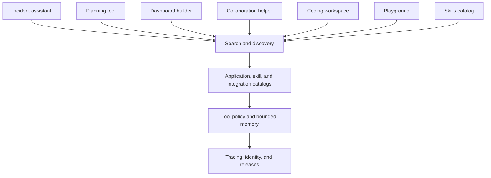
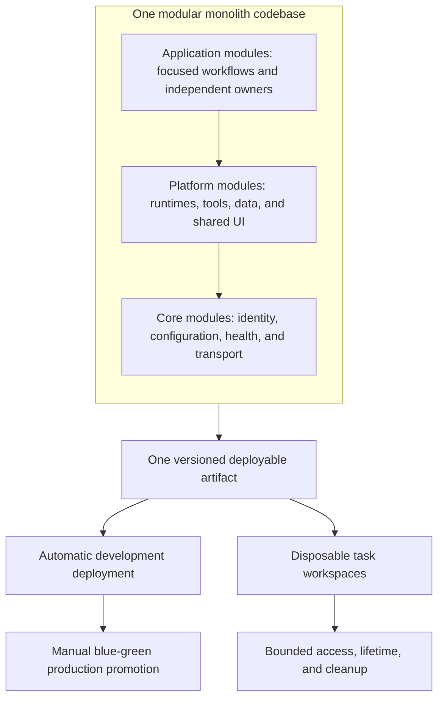
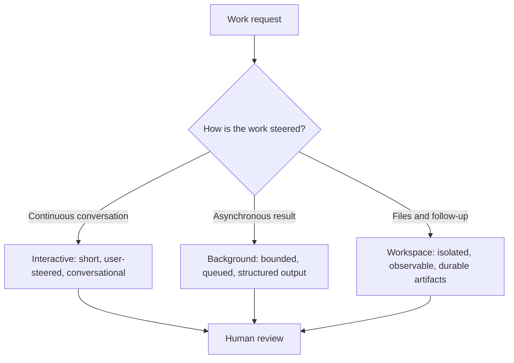
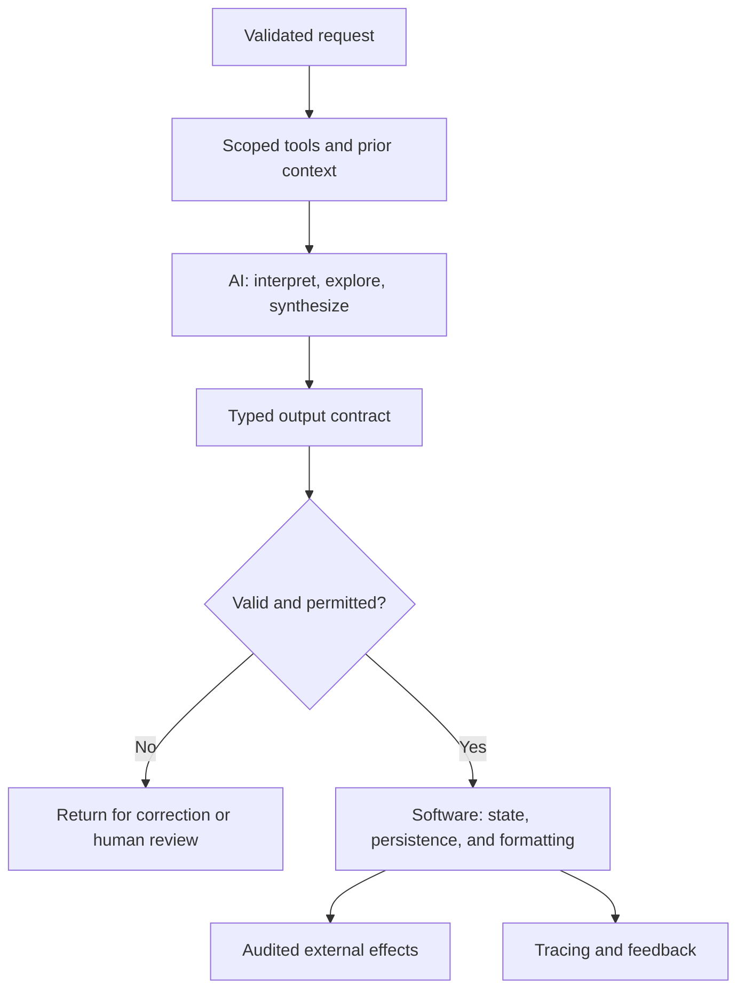
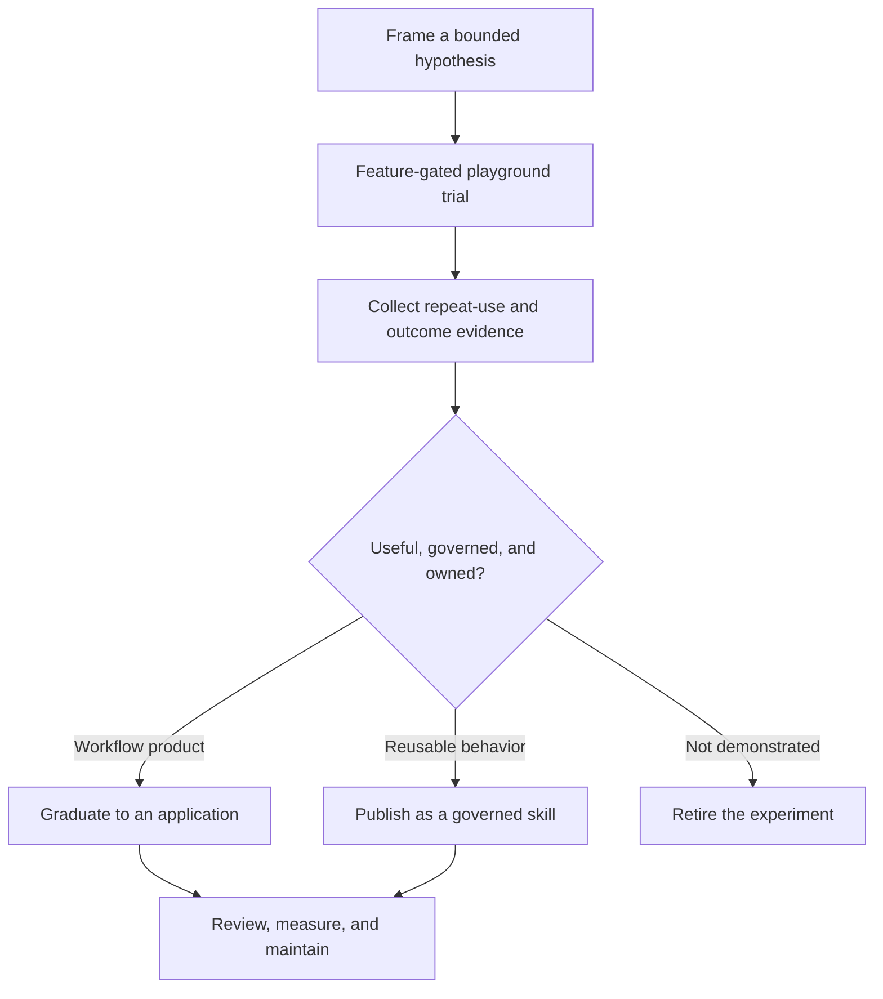
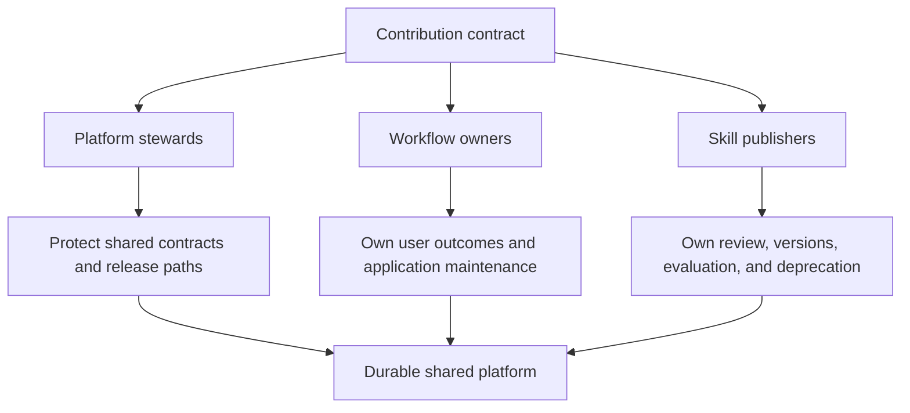

# Building Hedwig: From One AI Workflow to an Internal Platform

At DeepL, I led the development of an internal AI application platform I will call **Hedwig**. The name is a pseudonym. I am using it to explain the engineering decisions without turning internal systems or an operating model into public documentation.

Hedwig did not begin as a platform project. It began in March 2026 as a focused on-call investigation assistant. It could receive an operational event, gather relevant context through constrained tools, stream its progress, and produce a structured report for an engineer to review.

That narrow starting point mattered. It gave us a real workflow, real users, and a concrete way to learn where AI helped and where deterministic software was still the better answer.

Over the following months, contributors across disciplines added applications and platform improvements. The recurring work was not the prompt. It was authentication, persistence, authorization, observability, agent execution, integrations, deployment, and UI patterns. That is what turned one useful application into Hedwig: a shared internal surface for building and operating several kinds of AI-assisted tools.

This is a build retrospective, not a claim that every company should build its own AI platform. The strongest reason to build one is not that a chat interface looks easy to reproduce. It is that the work depends on internal context, controlled actions, repeatable workflows, and infrastructure that teams would otherwise rebuild separately.

The control-panel tour below introduces the eight tool categories as one connected platform. It advances through each tool's frames while keeping the shared identity, policy, delivery, and review foundations visible.

> **Simulation note:** Every simulation in this article uses scripted, fictional, sanitized data. They illustrate workflow structure and interaction design only. They make no network calls, and they do not reproduce internal interfaces, catalogs, records, customers, or operational results.

## What Hedwig became

Hedwig was a modular internal application platform. Self-contained applications shared the expensive plumbing:

- Authentication, configuration, logging, health checks, and real-time updates.
- Agent registration, tool selection, persistence, and feedback loops.
- Integrations with internal engineering and business systems through narrow, typed interfaces.
- A shared design system and release path.
- Interactive, background, and isolated-workspace execution modes.
- Playgrounds, catalog discovery, Skills publishing, governed MCP integrations, bounded memory, and tracing.

The important part is what Hedwig did **not** try to be. It was not one universal agent that could do everything. It was a place where teams could build focused applications without independently solving the surrounding platform problems every time.

That distinction kept becoming more useful as the number of workflows grew. An operational assistant, a planning tool, a dashboard generator, a Slack-facing helper, and a coding workflow do not have the same user experience or success criteria. They can still benefit from the same identity model, observability, deployment process, agent controls, and UI primitives.

The platform vocabulary eventually needed sharper boundaries: **applications own workflows; playgrounds test ideas; skills package behavior; MCPs expose governed integrations; memory supplies bounded prior context**. Those categories could compose, but treating them as synonyms obscured who owned an outcome and which controls applied.

Discoverability became another shared concern. Cmd/Ctrl+K joined local navigation with results from remote catalogs, so a user could move from a known application toward an available skill or integration without learning several separate interfaces. It did not search literally everything, and a result appearing in a catalog established availability, not adoption or quality.

### The pivot from application to platform

The original on-call workflow needed a surprisingly large amount of supporting software. An agent needed a defined job, bounded tools, a way to report progress, a durable record of what happened, feedback, and a safe path to hand work back to a person.

The next application needed many of those same things. So did the one after that.

The natural response would have been a collection of independent services. We went in a different direction: a deliberately modular monolith with three layers.

| Layer | Responsibility |
| --- | --- |
| Core | Server lifecycle, authentication, configuration, logging, metrics, health checks, and real-time transport. |
| Platform | Agent runtimes, tool registration, integrations, persistence, feature controls, shared UI, and team configuration. |
| Applications | Co-located server and client slices for one user-facing workflow. |

The dependency rule was simple: applications could depend on core and platform, but not on one another. That was not architectural purity for its own sake. It kept reuse intentional. A new application inherited the platform capabilities it needed instead of importing another application's accidental assumptions.

A modular monolith was the right tradeoff for this stage. It made integration cheap, kept the operational surface manageable, and let teams iterate quickly. The cost was shared deployment risk and more coordination as the platform grew. The answer was not to claim that the boundaries were perfect. It was to make them visible with application manifests, ownership rules, scoped data, and review gates.

#### Code boundaries and deployment boundaries

The modular monolith was one codebase producing one deployable artifact. That artifact was promoted into separate long-lived environment deployments, while workspace agents created disposable runtimes for individual tasks. The long-lived deployments served the platform; the disposable workspaces contained task execution and were expected to be bounded, observable, and cleaned up.

Those were different boundaries for different risks. Code boundaries kept applications from importing one another's assumptions. Deployment boundaries separated durable service operation. Workspace boundaries limited the files, credentials, lifetime, and compute attached to one run. This is intentionally an abstract topology: the durable lesson is the separation of responsibilities, not the particulars of an internal setup.

The delivery path made that separation concrete. Approved changes deployed automatically to the development environment, where a short, memorable internal URL gave contributors and reviewers one dependable place to inspect the current build. Production promotion remained a manual decision after the relevant checks, preview, and review evidence were complete. Blue-green deployment kept that production transition reversible: the next version could be verified alongside the current one before traffic moved, then rolled back cleanly if the evidence did not hold.

## Important features to showcase

### Build the environment, not just the prompt

The most reusable Hedwig feature was not a model wrapper. It was the environment around the model.

Each agent declared its execution mode, selected tools, prompt builder, output contract, and budget. The platform supported three broad modes:

1. **Interactive agents** for a person asking questions and steering a conversation.
2. **Background task agents** for bounded work that could run asynchronously and return a structured result.
3. **Workspace agents** for longer-lived tasks that needed an isolated environment, logs, files, terminal access, previews, and follow-up work.

This made it possible to meet a workflow where it actually lived. Some jobs were better as a web application. Some were better in a collaboration tool. Some needed a durable workspace that could be watched and corrected while it ran.

**Errol** is the pseudonym I use here for Hedwig's background coding agent. It became a popular workflow because it turned a bounded engineering request into a reviewable change request without requiring a person to hold an interactive session open. Its value came from continuous operational improvements, not a single agent prompt: capacity controls kept queues useful under parallel demand; resilient Kubernetes jobs isolated and retried work; automated merge-request comments shortened the first review pass; and Slackbot thread triggers made it possible to start or follow a task where the discussion was already happening.

Errol also remained an experimentation surface. OpenHands-informed experiments helped test agent execution patterns, while the surrounding deterministic pipeline kept permissions, state transitions, previews, automated checks, and merge gates outside the model. That separation let the coding workflow iterate quickly without granting the agent authority to complete consequential actions on its own.

#### Tracing, memory, and integrations

Langfuse tracing gave the platform a common place to inspect model calls and agent spans when telemetry was actually emitted. That qualifier matters: configuration and instrumentation are prerequisites, not proof of observed traces. A correctly configured environment could still emit no traces because a path was not exercised, instrumentation was incomplete, or delivery failed. We treated trace presence as something to verify rather than infer from settings.

Memory followed the same evidence discipline. The platform implemented bounded retrieval of prior context and evaluated its behavior, with limits on scope, selection, and retention. That showed the mechanism could work; it did not prove that memory improved user outcomes. Irrelevant memories could add noise or false confidence, so a workflow needed an evaluation that compared memory-assisted results with an appropriate baseline.

MCP support separated integration discovery from integration authority. A registry described available servers and capabilities, policy decided which applications or agents could request them, and a gateway provided a controlled execution boundary. Registration did not grant universal access. Typed inputs, scoped credentials, auditability, and application-level tool selection still determined what an agent could do.

### Make the pipeline more deterministic

The design principle was simple: use models where judgment is genuinely useful, and make everything around that judgment as deterministic as possible.

Models interpreted ambiguous requests, explored bounded evidence, and synthesized explanations or proposals. Deterministic software owned the pipeline and the flow: routing each request, selecting the permitted tools and context, validating structured output, enforcing permissions, persisting state, formatting results, advancing lifecycle states, and performing side effects.

Keeping the pipeline deterministic was the single most important decision for reliability. A model could propose a diagnosis, a query, or a change plan, but ordinary code decided whether the input was valid, whether the action was permitted, which state came next, and whether anything durable actually happened. Probabilistic reasoning stayed inside an observable, testable, reviewable flow instead of becoming the flow itself.

The goal was never to eliminate model uncertainty. It was to confine it, so the surrounding system stayed predictable: typed inputs, explicit transitions, bounded retries, durable records, automated checks, and human gates on consequential actions. Whenever we found ourselves debugging unpredictable behavior, the cause was almost always a step we had left to the model that should have been plain code.

CI/CD made that boundary practical during delivery. Each change request was automatically tagged with risk and domain labels, then routed through checks proportionate to those labels. The pipeline also deployed a frontend preview for review and generated automated AI reviewer comments alongside the usual validation.

That combination made iteration and review noticeably faster while holding a slightly higher quality bar. Contributors could inspect a real preview, respond to targeted review comments before a human opened the change, and give reviewers better evidence. Automation covered the repeatable checks and the first review pass; people kept responsibility for domain judgment, risky changes, and final acceptance.

That division is easy to state and hard to preserve. Every time we let prose stand in for an output contract, a downstream system had to guess what the agent meant. Every time we relied on prompt text as an authorization boundary, we created a policy that could not be reliably enforced. Structured tool calls and validated output added constraints, but they also made systems easier to test, observe, and safely connect to real workflows.

### Playgrounds are a stage, not a product claim

The platform made it cheap to trial an idea. That was useful, but it was not automatically a virtue.

Experiments had a clearer path when they remained visibly experimental and feature-gated rather than appearing as maintained applications. A playground could test whether a workflow was worth building without first needing a full product commitment. If it demonstrated repeat use and a clear owner, it could graduate into a maintained application or a governed skill. If it did not, it could be removed without leaving an orphaned service, release path, or design language behind.

This was one reason shared infrastructure paid off. A contributor could work on a narrowly defined application without first building login, deployment, observability, agent invocation, or the basic interface shell. The platform lowered the cost of trying an idea, while the application boundaries made it possible to stop trying one.

Playgrounds were not merely disposable experiments. Some became maintained, widely used features once they showed repeat use, a clear owner, and a workflow worth supporting. The conversion rate was deliberately low, around 15%: most ideas should remain bounded trials or be retired. That was a feature of the model, not a failure. The platform made exploration cheap while reserving the maintenance, reliability, and ownership commitment for the small set of ideas that earned it.

### A Skills Marketplace packages behavior

Skills captured reusable instructions, examples, and evaluation expectations as a versioned unit of behavior. The marketplace combined deterministic filters with AI-assisted topic search and a deterministic fallback, while metadata explained intended use, ownership, compatibility, and installation. This was packaging and distribution, not a claim that every listed skill had meaningful usage.

Prompt-only skills supported tryouts; tool-bearing skills were simulated rather than executed. Publication remained reviewed, requiring a named owner, bounded purpose, version information, and a deprecation path. Simulation helped review behavior, but it did not validate live permissions or integration effects.

### From available to discoverable

A platform can accumulate useful capabilities that remain effectively invisible. Application navigation, a Skills Marketplace, an MCP registry, documentation, and Cmd/Ctrl+K addressed different parts of that problem. Search provided one entry point across local routes and selected remote catalogs; the catalogs supplied metadata; owners supplied descriptions and examples; policy determined whether discovery could become use.

These layers also prevented an easy measurement mistake. Catalog footprint measured what could be found. Search impressions measured what people encountered. Launches and repeat runs measured use. Accepted outputs and completed work offered stronger evidence of value. Availability was not adoption, and adoption was not quality.

Discoverability had a maintenance cost. Stale entries, ambiguous names, missing owners, and incompatible versions made a large catalog worse rather than better. Review and deprecation were therefore part of search quality, not administrative work around it.

## What did not work

The useful history is not just the list of features that survived.

We repeatedly learned that broad access was not the same as capability. Tool access became more explicit and agent-specific rather than giving every agent every integration. That improved both safety and debuggability.

We learned that polling was a poor default for long-running work. It made progress feel unreliable and created lifecycle problems at exactly the point where a user most needed confidence. Event streaming was more complex, but it made asynchronous work understandable.

We learned that fully agent-generated artifacts were often too hard to trust or maintain. In several cases, the better product was a deterministic builder that used AI only for the analysis where judgment was valuable.

We learned not to treat configured telemetry as observed telemetry. Instrumentation could be present while a workflow emitted no traces, so rollout checks needed to verify real spans from exercised paths.

We learned that more context was not always better context. Memory retrieval could surface irrelevant history that distracted the agent, which made bounded selection and workflow-specific evaluation more important than the existence of a memory feature.

We learned to delete features. An experiment that receives little repeat use should not be preserved just because it was difficult to build. Removing low-value surfaces is part of keeping a platform coherent.

We also learned that concurrency changes the problem. More parallel agent work can move the bottleneck to review, queues, infrastructure capacity, and coordination. Isolated workspaces helped, but they also required cancellation, limits, cleanup, stuck-run detection, and careful credential boundaries.

### Adoption was uneven, and that was useful information

The original assistant gained broad awareness, but the data also showed that its most intensive usage was concentrated. That is a healthier finding than a vague claim that an internal tool was "adopted."

Pageviews, sessions, and agent runs are signals, not outcomes. They can be dominated by testing, training, or one highly engaged maintainer. Better questions were:

- Did people return without being prompted?
- Did the output lead to an accepted decision, ticket, pull request, or completed task?
- Could a workflow be repeated by someone other than the original builder?
- Did the system reduce the time or coordination needed for a real job?

Those questions also helped separate the platform from its applications. Hedwig could make an application easier to build and operate; that did not prove the application was useful. Domain teams still needed to own that judgment.

## Ownership is part of the architecture

A shared platform creates an ownership problem as soon as it becomes useful.

Centralizing the plumbing reduced duplication, but it also risked centralizing every maintenance request. We pushed ownership outward through application boundaries, path-based review ownership, and contributor responsibilities. The platform team still had to protect the shared contracts, but it could not be the permanent owner of every domain workflow.

Skills extended that responsibility beyond applications. Publishing a skill meant owning its versions, review status, compatibility, evaluation expectations, and eventual deprecation. A marketplace without those lifecycle duties would turn discoverability into an inventory of unsupported behavior.

The handoff work made this especially clear. A platform with a thin maintainer group may be technically stable while still being organizationally fragile. Documentation, release practices, access paths, feature tours, open issues, and contribution guides are not paperwork after the engineering is complete. They are part of what makes an internal platform durable.

If I were starting again, I would establish the minimum maintainer model and application ownership earlier. It is much easier to add a new application than to create sustainable responsibility for it after people depend on it.

### Comparison with Ramp Inspect

Comparisons are only useful when they preserve the organizing question behind each system. Ramp Inspect asks how deeply a platform can optimize one demanding coding workload.

[Ramp Inspect](https://builders.ramp.com/post/why-we-built-our-background-agent) is a useful comparison, but it is not the same product category.

Inspect is a deeply optimized background coding-agent system. Its public description emphasizes per-session remote development environments, parallel work, coding-context integrations, testing, telemetry, visual verification, and pull-request workflows. Its central question is how to make the complete coding loop work better than local, generic agent tooling.

Hedwig addressed a broader question: how can teams build and govern many types of internal AI applications without each one reinventing the surrounding infrastructure? Its workspace agents overlapped with Inspect in meaningful ways, especially for coding workflows, but coding was one workload among several rather than the organizing principle of the entire platform.

| Dimension | Hedwig | Ramp Inspect |
| --- | --- | --- |
| Primary scope | Shared platform for internal AI applications | Background software-development agent |
| Extensibility unit | Applications, agent types, tools, and integrations | Coding sessions, repository environments, and clients |
| Execution model | Interactive, background, and isolated workspace agents | Per-session remote development environments |
| Main strength | Reusing governed internal infrastructure across workflows | Deep optimization of the coding loop |
| Verification | Structured output, tracing, domain tools, and application-specific checks | Tests, telemetry, screenshots, previews, and pull-request workflows |
| Tradeoff | Broad platform surface and shared coordination cost | Substantial investment in a coding-specific runtime and client experience |

The overlap is real, especially around isolated execution and review, but the systems make different things first-class:

| Capability | Similar or shared | Hedwig emphasis | Ramp Inspect emphasis |
| --- | --- | --- | --- |
| Isolated execution | Yes | Supports workspace agents alongside other application modes | Purpose-built remote development environment per coding session |
| Agent workflow | Yes | Governed tools, typed output, and application-specific flows | End-to-end software-development task execution |
| Review evidence | Yes | Domain checks, structured output, and workflow-specific human gates | Tests, telemetry, screenshots, previews, and pull-request review |
| Frontend preview | Yes | A delivery artifact for reviewing an application change | A core part of visual coding-agent verification |
| Integrations | Yes | Shared tool policy, MCP governance, memory, and internal application contexts | Coding context and repository-environment integrations |
| Product scope | Different | Multiple internal AI application categories | One deeply optimized coding workflow |
| Ownership model | Different | Application teams own domain workflows on shared foundations | The coding-agent runtime owns the complete development loop |

Inspect looks like the stronger reference point for a company whose primary goal is a best-in-class background coding agent. Hedwig's lesson was different: an internal platform can make focused AI applications cheaper to build, provided the platform stays opinionated about safety, ownership, and the distinction between experimentation and a maintained product.

### Comparison with Pigwidgeon

**Pigwidgeon is a pseudonym for another mature internal platform at the same company.** It is discussed only at the level needed for an architectural comparison.

Where Hedwig used a monorepo and a shared AI runtime to make application integration cheap, Pigwidgeon favored independent repositories, images, and deployments. Its golden path standardized broad infrastructure concerns such as image builds, CI/CD, authentication, secrets, network policy, optional databases, and deployment status, while teams retained app-specific AI, runtime, and UI choices.

That made the two platforms answers to different coordination problems. Hedwig optimized reuse inside an opinionated AI application environment: common agents, interfaces, policy, tracing, catalogs, and execution modes. Pigwidgeon optimized team autonomy around a common hosting path: each service could choose its own internals while conforming to shared operational expectations.

The broad catalog footprint around Pigwidgeon is evidence that it was widely adopted as a hosting path. It is not evidence of monthly active users, application quality, or business impact. As with Hedwig's catalogs, the existence and availability of entries support a narrower claim than sustained use or valuable outcomes.

## Feature tour

The eight focused exhibits below gather the domain surfaces in one place, moving from the original on-call workflow through delivery, discovery, and governed integrations. Each one expands a single category from the control-panel tour above.

#### On-call investigations and weekly operations review

The on-call flow turns an alert into bounded evidence, a reviewable diagnosis, and owned follow-up work. Its final frame shows the automatically generated weekly operations review, which saved teams substantial preparation time; with clearer ownership, tracking, and UX, the action-item completion rate rose sharply.

#### Remote code runners: Errol and interactive workspaces

This exhibit separates Errol's resilient background jobs from live workspaces that a person can steer. Capacity controls, Kubernetes jobs, previews, automated reviewer comments, Slack updates, and human merge gates form the delivery path around the coding model.

#### Customer API usage graphs

The customer view combines deterministic usage and SLO calculations with AI-assisted query drafting. Region cards and the weekly attainment matrix keep misses visible instead of hiding them inside a generated narrative.

#### Playgrounds and Skills Marketplace

The playground makes a bounded idea cheap to try without presenting it as a maintained product. Skills then provide a reviewed path for packaging useful behavior with an owner, lifecycle, compatibility, and deprecation expectations.

#### Cmd/Ctrl+K discovery

The command palette joins instant local navigation with selected catalog results. Lifecycle labels explain whether a result is maintained, experimental, or local before a user opens it.

#### Read-only Databricks MCP

The data-query companion demonstrates a deliberately narrow MCP contract: one read-only SQL tool with a visible lifecycle and capped results. Deterministic validation rejects writes before they can become side effects.

#### MCP tools library

The library makes governed integrations discoverable without confusing discovery with authority. Useful MCPs included Slack, Backstage, Confluence, Grafana, GitLab, and incident-operations surfaces; every tool carried purpose, ownership, risk, permission, and lifecycle metadata, while consequential actions retained an explicit human gate.

#### Slackbot operations

The Slackbot surface follows a maintained collaboration agent after launch rather than stopping at a creation wizard. Channels, simulated threads, bounded memory, logs, ratings, and recent conversations give owners one operational view.

## Historical Timeline

This evidence-qualified chronology separates milestones from the caveats that qualify them. Its version labels are editorial maturity markers, not source-control tags or completion claims; the underlying records are intentionally not published.

### What I learned

Hedwig grew from a useful workflow rather than a clean platform plan. That is probably why it acquired the abstractions it actually needed.

- Start with one real job, not a generic agent framework.
- Centralize the plumbing that is expensive to recreate: identity, observability, release paths, tool policy, and UI foundations.
- Give applications, playgrounds, skills, MCPs, and memory distinct contracts instead of grouping every capability under "agents."
- Keep domain ownership distributed. A platform should make applications easier to build, not take responsibility for every application forever.
- Treat permissions as code and infrastructure, not instructions in a prompt.
- Prefer deterministic software whenever judgment does not add value.
- Measure repeat, accepted outcomes rather than activity alone.
- Separate availability, discovery, adoption, and value in both metrics and language.
- Design the maintainer model before the platform becomes important.

The enduring lesson is not that every internal tool should turn into a platform. It is that a platform becomes justified when many real workflows share the same hard constraints. When that happens, the durable asset is not the chat interface. It is the environment that makes the right actions possible, observable, and governable.
