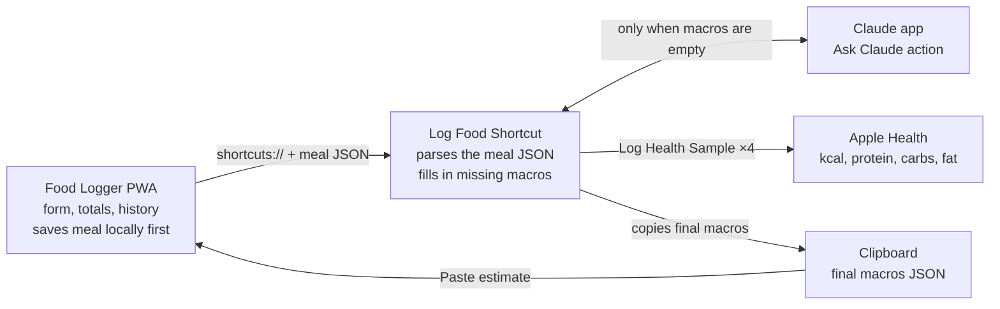

# Automatic Food Logger Design

**Date:** 2026-10-04
**Topic:** Log meals to Apple Health from a PWA, with Claude estimating macros
**Status:** Implemented in PR #299, pending on-device testing

[written by AI] A free PWA at `leoncheng.dev/automatic-food-logger` logs each meal to Apple Health in one tap. An Apple Shortcut writes to Health and asks the already-logged-in Claude app for macros, so there's no subscription and no API key.

## Why it's shaped this way

- **The web can't write to HealthKit.** A Shortcut can, and a page can launch one with a `shortcuts://` link.
- **A PWA can't log in with Claude.** The Claude app already is, and its Ask Claude action runs inside the Shortcut.
- **Return links open Safari,** which can't see the PWA's storage. So the PWA saves the meal first, and estimates come back through the clipboard.

```text
   You type "chicken burrito bowl"
              │
              ▼
   ┌─────────────────────┐
   │  Food Logger PWA    │   ✗ can't sign in with Claude
   │  saves meal locally │   ✗ can't write to Apple Health
   └──────────┬──────────┘
              │ shortcuts://run-shortcut?...   (meal JSON)
              ▼
   ┌─────────────────────┐  macros    ┌─────────────────────┐
   │  Log Food Shortcut  │──missing?─▶│ Claude iOS app      │
   │  (Apple, free)      │◀──JSON─────│ already logged in   │
   └──────────┬──────────┘            │ = your subscription │
              │                       └─────────────────────┘
              ├──▶ Log Health Sample ×4 ──▶ Apple Health
              │
              └──▶ copy JSON ──▶ clipboard ──▶ PWA "Paste estimate"

   Paths the PWA can't use:
   PWA ──✗── "Sign in with Claude"   no such login for other apps
   PWA ──$── Claude API key          billed separately; key visible
```

## Architecture



The PWA never touches HealthKit. It hands the meal to the Log Food Shortcut, which asks Claude only when macros are missing, writes four samples to Health, and returns the estimate to the app through the clipboard.

## How a meal gets logged

1. Type the meal and tap **Log**. Add macros if you know them, or leave them blank.
2. The PWA saves the meal, then opens the **Log Food** Shortcut with it as JSON.
3. If macros are blank, the Shortcut asks Claude. It then writes kcal, protein, carbs and fat to Health and copies the result.
4. Back in the PWA, **Paste estimate** fills in the macros. Recent meals re-log in one tap.

## Contracts

- **Handoff link:** `shortcuts://run-shortcut?name=Log%20Food&input=text&text=<encodeURIComponent(JSON)>`. It uses `encodeURIComponent`, not `URLSearchParams`, because Shortcuts does not decode `+` as a space.
- **Payload:** `{"description","loggedAt","kcal","protein_g","carbs_g","fat_g"}`. The four macro fields are `null` when the user leaves them blank, which tells the Shortcut to ask Claude.
- **Estimate:** the PWA reads the first JSON object on the clipboard. It accepts `protein_g` / `proteinGrams` / `protein` style keys and rejects missing or negative values.
- **Storage:** meals live in `localStorage` under `automatic-food-logger:meals`. Each one is written before the handoff, and the app keeps working in memory when storage throws.

## What we build

| Piece | Where |
| --- | --- |
| React feature: form, totals, history, setup guide | `src/features/automatic-food-logger/` |
| Manifest, service worker, icons | `public/automatic-food-logger/` |
| Route plus Beta listing on the home and apps pages | `App.tsx`, `HomeRoute.tsx`, `AppsIndexRoute.tsx`, `RouteMetadata.tsx` |
| Log Food Shortcut | Built once by hand, following the `/setup` page |

It copies the existing Weather and Workout Lab PWAs. Rollout: a PR preview, a test on the phone, then a merge to `main`.

## Not doing

No native app, no Claude API, no server or cross-device sync, and no photo recognition in v1.

## Open questions

- [ ] The exact name and options of the Ask Claude Shortcuts action.
- [x] Whether Log Health Sample accepts an ISO date directly. Not needed: meals are logged as they happen, so the Shortcut keeps the default date (now).
- [x] Whether the listing needs a note that meal data stays on the device. The app card and the footer both say so.
